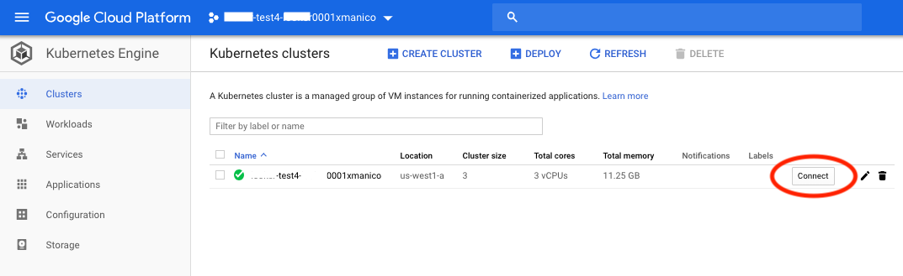

# Kubernetes Cluster Setup

The goal of this lab is to successfully setup a Kubernetes cluster using [MiniKube](https://minikube.sigs.k8s.io) (local setup) or [GKE](https://console.cloud.google.com) (no installation required). 
 We will use this cluster throughout the remainder of the labs.

## Requirements


### MiniKube (local setup)

_minikube_'s primary goals are to be the best tool for local Kubernetes application development and to support all Kubernetes features that fit.
For more information on how to get started with minikube on your local machine please visit : https://minikube.sigs.k8s.io/docs/start/

The lastest kubernetes version tested with these labs is v1.15.4.  To start minikube with a specific k8s version run this command :

```
minikube start --kubernetes-version v1.15.4
```

Important note for **MAC USERS**: The latest minikube version might not work properly due to some DNS issues. If this is the case, make sure enable the _Kubernetes Cluster_ in _Docker Desktop_.

### GKE (no install)

To minimize software and configuration on your local machine, will be using a service called [Google Cloud Shell](https://cloud.google.com/shell/docs/) which provides you with command-line access to your cloud resources directly from your browser. Cloud Shell supports the latest versions of Google Chrome, Mozilla Firefox, Microsoft Edge, Microsoft Internet Explorer 11+ and Apple Safari 8+. Safari in private browser mode is not supported.

#### About GKE
Kubernetes Engine is a managed, production-ready environment for deploying containerized applications in Google Cloud Platform. An account has been provisioned with a Google account under the domain as well as a multi-node cluster.

The cluster master runs the Kubernetes control plane processes, including the Kubernetes API server, scheduler, and core resource controllers. The master's lifecycle is managed by Kubernetes Engine when you create or delete a cluster. This includes upgrades to the Kubernetes version running on the cluster master, which Kubernetes Engine performs automatically, or manually at your request if you prefer to upgrade earlier than the automatic schedule.


#### GKE : Explore Your Pre-Provisioned Kubernetes Cluster
In the navigation on the left side of the console, click `Kubernetes Engine`. Here you will find the details about the cluster and a GUI for accessing and administering workloads and services.

#### GKE : Launch Cloud Shell
There is a button titled `Activate Google Cloud Shell` located in the top-bar navigation of the console. When clicked, a terminal will appear in the lower half of the console. This gives you direct command-line access to your Kubernetes cluster.

Cloud shell comes packaged with a beta feature called `code editor` which gives you a minimal IDE for viewing and editing files. This will be used throughout the remainder of the labs. The link is found in the upper-right hand corner of the terminal.

#### GKE : Connect to your Kubernetes Cluster
Most of the tools necessary to complete the labs come pre-installed in Google Cloud Shell including `kubectl` which is used extensively to interact with your cluster. Ensure your cluster is operational by running the following commands.

First, we need to use connect to the cluster using Cloud Shell. In the navigation on the left, click `Kubernetes Engine -> Cluster` then click the `Connect` button next to your cluster:



You will then be presented with options to connect to the cluster. Click `Run in Cloud Shell`. This will open Google Cloud Shell in the same browser tab. It will also paste a command into the terminal. All you need to do now is hit enter to run the command.

The command you are running will look like this:
```
gcloud container clusters get-credentials <YOUR-CLUSTER-NAME> --zone us-west1-a --project <YOUR-PROJECT-NAME>
```


## Task 1: Clone the Git Repository
In your home directory, we are going to pull in the documentation and source code used for the course labs. We can do this by running the following command:
```
git clone https://github.com/ManicodeSecurity/Defending-DevOps
```

## Task 2 : Check k8s cluster connection
You can ensure you are connected to your cluster by running the following command. This will display all of the default pods running in the cluster.
```
kubectl get pods --all-namespaces
```
